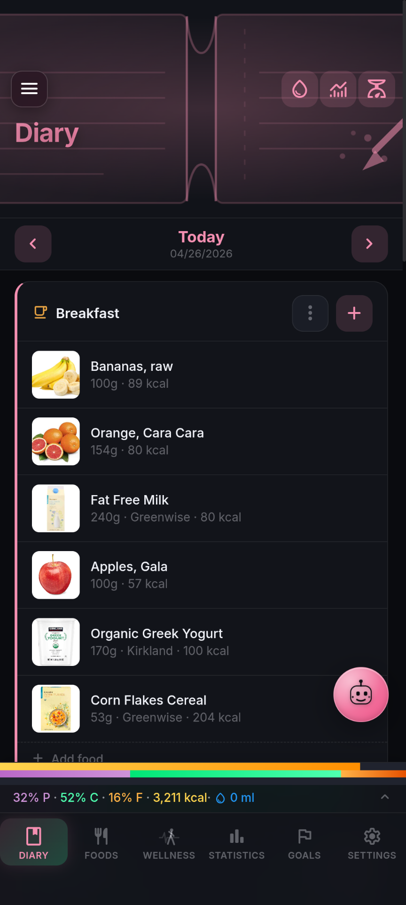
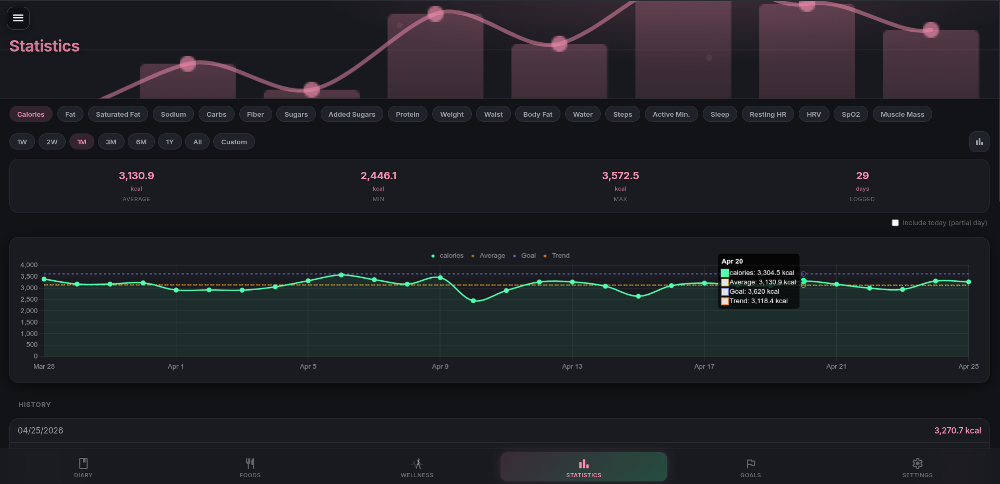
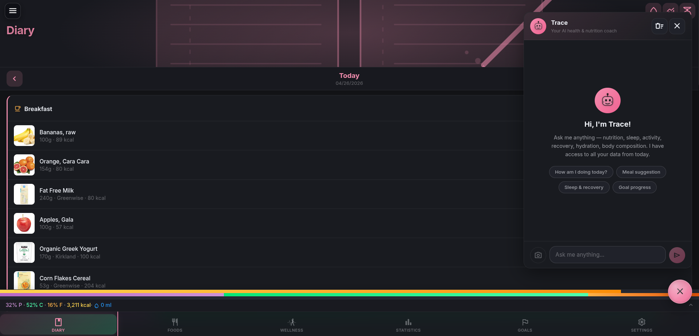
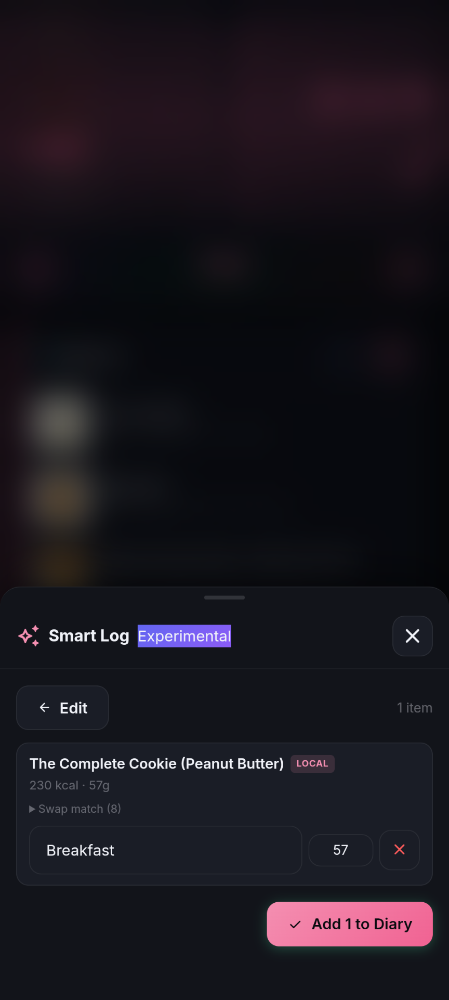

# NutriTrace

**Trace Every Bite** — A self-hosted personal nutrition tracker built for privacy and full data ownership.

NutriTrace runs entirely in a single Docker container on your own hardware. No accounts on external services, no data leaving your network, no subscriptions.

---

## Principles

- **Self-hosting is and will remain free.** The server, PWA, and source code will never be paywalled.
- **No trackers, no analytics, no telemetry.** NutriTrace doesn't phone home — your usage is invisible to anyone but you.
- **Your data stays on your hardware.** No central server, no cloud sync that can read it; nothing leaves your network unless you opt into a third-party integration (OFF, USDA, Fitbit, etc.).
- **Open source under AGPL-3.0.** Every line that touches your data is readable.

---


---

## Features

### Diary
- Daily food diary with configurable meals (Breakfast, Lunch, Dinner, Snacks, or fully custom)
- Quick-add foods, meals, and recipes with portion scaling — food notes (e.g. "1 serving = 150g cooked") are surfaced at add time
- Nutrition bar with macro summary and per-meal breakdowns
- Body stats tracking (weight, measurements, and more) with customizable fields
- Water intake tracking with configurable containers and daily goal
- Long-press (mobile) or right-click (desktop) for item edit/move/delete actions
- Per-meal ⋮ menu: copy or move all items to another meal, copy the meal to another date, save the meal to your library, or clear it
- Per-day free-text notes (e.g. "felt bloated after lunch", "post-workout") — toggleable, with an indicator on dates that have a note

<p align="center">
  
</p>

### Foods & Meals
- Personal food database with photos, barcodes, categories, and custom labels
- Barcode scanner (camera) for quick food lookup via Open Food Facts
- Meal and recipe builder with drag-to-reorder ingredients
- Proportional nutrition scaling when editing serving size
- Import foods from Open Food Facts, USDA FoodData Central, or Mealie (recipe manager)

### Statistics
- Charts for any tracked nutrient or body stat over time
- Bar and line chart modes; average, trend, and goal overlay lines
- Configurable date ranges



### Goals
- Calorie and nutrient goals with template support
- Wizard calculates TDEE (Mifflin-St Jeor) and water goal from body stats and activity level

### Settings & Customization
- Light / dark / system theme
- Custom accent color (presets or full hex color picker)
- Configurable navigation style (bottom bar, sidebar, or both)
- Custom nutriment visibility and display order
- Custom body stat fields and display order
- Date and time format options (US / ISO / EU / Natural)
- Unit system: weight, height, length, distance

### Multi-User Support
- Optional user management — runs perfectly as a single-user app with no login required
- Admin can invite additional users via email or shareable link
- All data is scoped per user
- Configurable session timeout

### AI Assistant (Trace)
- Optional AI chat assistant for nutrition questions and logging help
- Supports Claude (Anthropic), OpenAI, and Google Gemini — bring your own API key
- Tool use across all providers: Trace can query your real diary (with day notes + per-item notes), saved meals/recipes library, wellness metrics, body composition, workouts, and goals — no hallucinated numbers
- Optional Goal Insights mode: proactive analysis of actual intake vs targets with evidence-based suggestions



### Backup & Restore
- Full backup: ZIP archive of all database tables + uploaded images, stored on the server
- Download backups to your device or restore from a previously saved backup
- Upload and restore from a backup file taken on another instance
- Portable JSON export/import (foods, meals, diary, settings — no images)
- Local Full Backup (Android local-only mode): self-contained `.zip` with embedded image files for phone-to-phone transfer without a server
- CSV diary export
- Import from Waistline (Android nutrition app)

---

## Smart Log — voice + AI food logging

Smart Log is an experimental feature that lets you log food by **pressing and holding the Trace button** on any page and saying what you ate. The AI parses your sentence and matches each item against your saved foods, meals, recipes, or yesterday's diary.

<p align="center">
  
</p>

### Setup
1. Settings → AI Assistant → enable the assistant and configure a provider key (Claude, OpenAI, or Gemini).
2. In the same section, enable the **Smart Log** toggle (Experimental).
3. Grant microphone permission the first time you use it.

### How to use it
- **Press and hold** the Trace floating button (any page) for ~½ second.
- The robot face morphs to a microphone, the FAB turns red, you'll hear a short beep and feel a haptic buzz.
- **Speak** what you ate.
- **Release** the button to commit. Slide your finger off the FAB before releasing to **cancel**.
- The Smart Log review modal opens with the parsed items already matched. Edit quantities, swap matches, change meal slots, then tap **Add to Diary**.

### What Smart Log can match

| Source | What it matches | Example phrases |
|---|---|---|
| **Foods** (default) | Single foods from your library, then Open Food Facts | "2 eggs", "a slice of toast", "Greek yogurt" |
| **Saved Meals** | Multi-ingredient meals you've built in MealEditor | "my **chicken caesar salad meal**", "the **pasta carbonara meal**", "for lunch I had my **morning bowl meal**" |
| **Saved Recipes** | Recipes you've saved (with `is_recipe: 1`) | "my **chicken stir fry recipe**", "made the **pasta carbonara recipe**", "from my **lasagna recipe**" |
| **Yesterday's diary** | Copy items from yesterday's matching meal slot | "**same as yesterday for lunch**", "**yesterday's breakfast**", "**repeat yesterday's dinner**", "**what I had for breakfast yesterday**" |
| **Water** | Adds to your water log (not the food diary) | "drank a glass of water", "500ml of water", "had my **protein shaker**", "two cups of water" |

The trigger words **"meal"**, **"recipe"**, and **"yesterday"** are how you tell the AI which kind of record to look for. Without those keywords, Smart Log defaults to searching individual foods.

### Meal slot detection
You can mention the meal in your sentence and Smart Log will route the items there automatically:

- *"for breakfast I had..."* → Breakfast
- *"snacking on..."* → first Snacks slot
- *"for my pre-workout..."* → matches a custom slot named Pre-workout
- *"snack 2 was a banana"* → Snack 2 (exact slot match)

Smart Log uses your **actual configured meal slot names** (visible in the AI prompt), so custom slots like "Snack 1 / 2 / 3", "Brunch", or "Late Night" all work. It also handles renamed defaults — if you renamed "Breakfast" to "Morning Bowl", saying "for breakfast" still routes there via fuzzy matching.

### What Smart Log does NOT do (yet)
- It does **not** log body stats (weight, measurements, etc.)
- It does **not** support multi-day patterns ("yesterday and today" — yesterday only works for the prior calendar day)
- It does **not** modify or delete existing diary entries — only adds new ones
- It does **not** know about diary entries older than yesterday

### Privacy
- **Audio is recognized on-device.** Android uses the system speech recognizer; the PWA uses your browser's Web Speech API. The audio itself never leaves your device.
- **The text transcript** is sent to your configured AI provider (Claude/OpenAI/Gemini) for parsing. This is the only network call to a third-party service.
- **Food matching is local-first.** Your saved foods, meals, recipes, and diary are searched on your own server first. Open Food Facts is only queried as a fallback for foods not in your library.
- **Nothing is sent to NutriTrace servers.** There are no NutriTrace servers — this is self-hosted.

### Cost
Smart Log uses a tightly-constrained prompt (~150 tokens in, ~50 out) so it's cheap. On GPT-4o mini or Claude Haiku, logging six meals a day for a year costs roughly **\$0.10 USD**. Gemini's free tier covers it entirely.

### Tips
- Mention the meal *and* the food in one sentence: "for breakfast I had 2 eggs and toast" → fewer modal corrections.
- Use the words **"meal"** and **"recipe"** explicitly when you want one of those records — otherwise the AI will look for individual foods first.
- The first time Smart Log fires on Android, you'll see a permission prompt for the microphone. Grant it.
- If voice recognition picks up the wrong words, just type into the text input on the modal (after the parser opens) — same matching pipeline runs.

---

## Self-Hosting with Docker

### Quick Start

1. Download the `docker-compose.yml` from this repo, or copy it directly:

```yaml
services:
  nutritrace:
    image: ghcr.io/traceapps/nutritrace:latest
    container_name: nutritrace
    ports:
      - "3000:3001"
    volumes:
      - ${DATA_DB_PATH}:/data/db
      - ${DATA_UPLOADS_PATH}:/data/uploads
    environment:
      - DB_PATH=/data/db/nutritrace.db
      - UPLOADS_PATH=/data/uploads
      - JWT_SECRET=${JWT_SECRET}
      - SMTP_HOST=${SMTP_HOST:-}
      - SMTP_PORT=${SMTP_PORT:-587}
      - SMTP_SECURE=${SMTP_SECURE:-false}
      - SMTP_USER=${SMTP_USER:-}
      - SMTP_PASS=${SMTP_PASS:-}
      - SMTP_FROM=${SMTP_FROM:-}
    restart: unless-stopped
```

No changes to this file are needed — everything is driven by `.env`. If you want to pin to a specific version, change `latest` to a release tag.

2. Copy `.env.example` to `.env` and fill in your paths:

```env
DATA_DB_PATH=/your/host/path/db
DATA_UPLOADS_PATH=/your/host/path/uploads
JWT_SECRET=your-long-random-secret

# Optional — SMTP for password reset emails and user invites
# If omitted, invites fall back to a copyable link instead of email
# SMTP_HOST=smtp.example.com
# SMTP_PORT=587
# SMTP_SECURE=false
# SMTP_USER=you@example.com
# SMTP_PASS=your-password
# SMTP_FROM=NutriTrace <noreply@example.com>
```

Generate a JWT secret:
```bash
openssl rand -base64 48
```

3. Start the container:

```bash
docker compose up -d
```

4. Open `http://localhost:3000` in your browser.

On first launch, a setup wizard walks you through enabling user management and creating your admin account. If you skip user management, the app runs in single-user mode with no login required.

---

## Environment Variables

| Variable | Required | Default | Description |
|---|---|---|---|
| `DATA_DB_PATH` | Yes | — | Host path for the SQLite database directory |
| `DATA_UPLOADS_PATH` | Yes | — | Host path for uploaded images and backups |
| `JWT_SECRET` | If using users | — | Secret key for signing auth tokens. Use a long random string. |
| `TOKEN_ENC_KEY` | No | derived from `JWT_SECRET` | At-rest encryption key for OIDC client secrets and wearable OAuth tokens. Set this if you want to rotate `JWT_SECRET` without invalidating stored secrets. |
| `RECOVERY_TOKEN` | No | — | Passphrase required to disable user management from the login page (lockout recovery). Without this the recovery endpoint is disabled. |
| `LOG_LEVEL` | No | `info` | Log verbosity: `error` \| `warn` \| `info` \| `debug`. Use `debug` for detailed wellness sync output (Fitbit, Withings, Garmin, Health Connect). |
| `SMTP_HOST` | No | — | SMTP server hostname (for password reset & invites) |
| `SMTP_PORT` | No | `587` | SMTP port |
| `SMTP_SECURE` | No | `false` | `true` for SSL (port 465), `false` for STARTTLS |
| `SMTP_USER` | No | — | SMTP username |
| `SMTP_PASS` | No | — | SMTP password |
| `SMTP_FROM` | No | — | From address, e.g. `NutriTrace <noreply@example.com>` |
| `AI_PROVIDER` | No | — | Lock Trace to a specific provider for all users: `claude` \| `openai` \| `gemini` |
| `AI_API_KEY` | No | — | Shared AI API key. Key is server-side only — never sent to the browser. |
| `AI_MODEL` | No | provider default | Override the AI model (e.g. `claude-haiku-4-5-20251001`) |
| `AI_ENABLED` | No | — | Set to `true` to auto-enable Trace for all users |

SMTP and AI settings can also be configured in the Settings UI. Environment variables take priority over UI values and lock those fields for all users.

---

## Data Persistence

Two host directories must be bind-mounted:

- **Database** (`DATA_DB_PATH`) — SQLite file. Survives container restarts and redeployments.
- **Uploads** (`DATA_UPLOADS_PATH`) — Food/meal photos and server-side backups (stored in `uploads/backups/`). Survives container restarts and redeployments.

Nothing else needs to persist — the container is stateless beyond these two volumes.

---

## Updating

```bash
docker compose pull
docker compose up -d
```

The database schema migrates automatically on startup.

---

## Tech Stack

| Layer | Technology |
|---|---|
| Frontend | Svelte 4, svelte-spa-router, Vite, PWA (service worker) |
| Backend | Node.js, Express, better-sqlite3 |
| Auth | JWT (httpOnly cookie), bcryptjs |
| Container | Docker, multi-stage Dockerfile |
| CI/CD | GitHub Actions → GitHub Container Registry |

---

## Wellness Integrations

NutriTrace can sync data from Fitbit, Withings, Garmin, and Android Health Connect. Each cloud provider (Fitbit/Withings/Garmin) requires registering a free OAuth application with the respective service and entering the credentials in **Settings → Wellness**. Health Connect is on-device and needs no developer setup.


### Fitbit
1. Go to [dev.fitbit.com](https://dev.fitbit.com) → **Register an App**
2. Application type: **Personal**
3. OAuth 2.0 Application Type: **Personal**
4. Callback URL: `https://your-nutritrace-domain.com/api/wellness/fitbit/callback`
5. Copy the **Client ID** and **Client Secret** into Settings → Wellness → Fitbit

### Withings
1. Go to [developer.withings.com](https://developer.withings.com) → create a developer account → **New Application**
2. Callback URL: `https://your-nutritrace-domain.com/api/wellness/withings/callback`
3. Copy **Client ID** and **Client Secret** into Settings → Wellness → Withings

### Garmin
Garmin Health API requires a partnership approval (not a free developer program). If you have access, set the callback URL to `https://your-nutritrace-domain.com/api/wellness/garmin/callback`.

### Health Connect (Android)
Reads steps, sleep, heart rate, weight, and exercise directly from the Android Health Connect API. Works in the NutriTrace Android app without any server setup — useful for users running fully local/offline. Enable in **Settings → Wellness → Health Connect** on the Android app and grant the requested permissions.

> **Note:** The callback URLs for Fitbit/Withings/Garmin must use your public domain (not `localhost`). All three require HTTPS.

---

## API Integrations

All external API calls are proxied server-side — no keys are exposed to the browser.

- **[Open Food Facts](https://world.openfoodfacts.org/)** — free barcode/food search (no key required)
- **[USDA FoodData Central](https://fdc.nal.usda.gov/)** — US food database (free API key required)
- **[Mealie](https://mealie.io/)** — self-hosted recipe manager integration

---

## Single Sign-On (OIDC) — Experimental

Optional. Connect any OpenID Connect 1.0 compliant identity provider — **Authentik**, **Keycloak**, **Authelia**, **Pocket ID**, **Auth0**, **Google**, etc. — to sign in to NutriTrace with credentials your IdP already manages. Existing password login keeps working alongside SSO; admins can also disable password login entirely once SSO is set up.

**Prerequisite**: User Management must be enabled and you must be signed in as an admin. If your instance is single-user, run **Settings → User Management → Set Up** first to create your admin account (skip this step if you already enabled User Management).

**Two ways to configure**:

1. **UI** (admin-only): **Settings → Authentication → OIDC providers**. Has a card picker for common IdPs that pre-fills sensible defaults (issuer-URL pattern, scope, claim names, branded logo). Custom / Generic OIDC is the fallback for anything not on the list. Enter your provider's `issuer URL`, `client ID`, and `client secret`, save, then test discovery with the network-check button before letting users sign in.

2. **Environment variables** (for IaC / docker-compose / k8s deployments): define providers in your `.env` and the server bootstraps them on startup. Mirrors how SMTP and AI provider creds are env-locked today.

   ```env
   # Single provider — most common case
   OIDC_ISSUER=https://auth.example.com
   OIDC_CLIENT_ID=nutritrace
   OIDC_CLIENT_SECRET=...
   OIDC_DISPLAY_NAME=Authentik

   # Optional fields (per-provider)
   OIDC_SCOPE=openid profile email
   OIDC_ADMIN_GROUP_CLAIM=groups
   OIDC_ADMIN_GROUP_VALUE=NutriTraceAdmins
   OIDC_AUTO_LINK=1
   OIDC_AUTO_REGISTER=0

   # Multi-provider — use numbered prefix instead
   OIDC_PROVIDER_2_ISSUER=https://other-idp.example.com
   OIDC_PROVIDER_2_CLIENT_ID=...
   OIDC_PROVIDER_2_CLIENT_SECRET=...
   OIDC_PROVIDER_2_DISPLAY_NAME=Keycloak
   ```

   `OIDC_*` (unnumbered) is an alias for `OIDC_PROVIDER_1_*`. Numbered providers can be added independently of the first. Env-defined providers show with a lock badge in the Settings UI and are read-only — managed entirely from your config files.

**Per-provider toggles**:
- **Auto-link existing users (verified email)** — when the IdP says `email_verified=true` and the email matches an existing NutriTrace user, link them silently on first SSO sign-in. Defaults ON; safe for any IdP you trust to verify emails.
- **Auto-register new users** — let anyone with an account at the IdP create a brand-new NutriTrace account on first sign-in. Defaults OFF; leave off for shared IdPs (Google, work SSO) unless you want blanket onboarding.
- **Admin group claim / value** — optionally elevate users to admin based on a claim. E.g. claim `groups` containing value `NutriTraceAdmins`. Re-evaluated on every sign-in so revoking a user's admin in your IdP propagates immediately.

**Mobile**: Android in server-connected mode supports SSO too. The app opens the IdP authorize URL in an in-app browser (Chrome Custom Tabs); the IdP redirects back via `nutritrace://oidc-callback/` deep link, the app intercepts it and signs you in — no manual paste, no token wrangling.

**Security**: client secrets are encrypted at rest using the same key derivation as wearable OAuth tokens. Email-based auto-linking only fires when the IdP explicitly flags the email verified, AND the provider's `auto-register` is enabled — both gates have to be on, since email-based auto-link is the main account-takeover vector if the IdP is dishonest about verification.

---

## Translations

NutriTrace ships with English (`en`) translations covering navigation, settings, login & onboarding, the diary's primary actions, the AI assistant FAB, and most user-visible strings. Pick your active language from **Settings → Regional & Units → Language** — the change is reactive (no reload needed).

**Want to contribute a translation?** It's a single JSON file:

1. Copy [`src/i18n/en.json`](src/i18n/en.json) to `src/i18n/<your-locale>.json` (e.g. `fr.json`, `de.json`, `nl.json`, `pt-BR.json`).
2. Translate the values, leave the keys untouched. HTML/Markdown inside values (e.g. `<strong>`, `<code>`, `<br>`) stays as-is.
3. `npm run i18n:check` reports per-locale coverage — run it locally to see what's missing.
4. Open a PR. See [CONTRIBUTING.md → Translations](CONTRIBUTING.md#translations) for conventions, regulatory-term gotchas (nutrient labels — use the term your country's nutrition labels use, not a literal translation), and the existing volunteer thread.

Server-side strings (email subjects, push-notification bodies, AI system prompts) and admin-only settings panels are intentionally English-only for now and will follow once the user-facing scaffolding is stable.

---

## Roadmap

**Coming soon:**
- **Android app** — works server-connected or fully local/offline, with Health Connect support. Currently in development and testing; public release planned during the v1.x cycle. Distribution channels will be announced before public release. *Server-mode users:* release-signed APKs require HTTPS for the connection to your NutriTrace server (auth-token protection on open WiFi). See [DEPLOY.md → Connecting from Android](DEPLOY.md#connecting-from-android) for the four supported paths (Let's Encrypt, Cloudflare/Tailscale tunnels, self-signed CA install, or building the debug APK yourself).
- **Adaptive TDEE** — learn your true energy expenditure from intake + weight trend over time

**Future:**
- **iOS app** — pending hardware and Apple Developer account access (see Support).

---

## Wellness scores — how they're computed

NutriTrace surfaces three derived wellness scores. Where the source device exposes its own value via API, that value is used directly. Where it doesn't, NutriTrace computes one. The computed scores are prefixed **Trace** in this section to make the distinction explicit.

| Score | Fitbit | Garmin | Withings | Health Connect |
|---|---|---|---|---|
| Sleep | **Trace Sleep Score** (computed — Fitbit API doesn't expose its own) | Native `overallSleepScore` | Native sleep score when present | **Trace Sleep Score** |
| Daily Readiness | **Trace Readiness** (computed) | **Trace Readiness** (computed) | **Trace Readiness** (computed) | **Trace Readiness** (computed) |
| Stress | **Trace Stress** (computed) | Garmin's native `stress_avg` is stored separately; **Trace Stress** is also computed | **Trace Stress** (computed) | **Trace Stress** (computed) |

**Trace Sleep Score** combines sleep duration, deep / REM percentages, SpO₂, HRV, and efficiency into a single 0–100 value (formula in `server/routes/fitbit.js`). **Trace Readiness** weighs HRV against a 30-day baseline plus resting HR and last night's sleep, with an activity-spike penalty. **Trace Stress** is a 7-day-smoothed inverse of HRV + RHR + sleep (formula in `server/lib/wellness-scores.js`).

These scores prioritize day-to-day consistency across whatever data sources you've connected. They're not intended to match what each device's own app shows — readings may differ from device-native scores.

If a wellness integration on your device behaves wrong (missing data, weird numbers), file an [Integration Test report](https://github.com/traceapps/nutritrace/issues/new?template=integration_test_report.md) — the more devices reported, the easier it is to spot integration-specific quirks.

## Experimental features

Features marked **Experimental** in Settings (Smart Log, Goal Insights, Food Sharing, Dynamic Calorie Goal, Garmin integration) work but haven't been hammered enough to drop the label. Real-world bug reports help promote them to stable. The badge comes off when edge-case handling is solid, not on a calendar.

---

## Troubleshooting

If you're filing a bug, logs make it 10× faster to fix. Easiest path first:

**In-app logs** (PWA + Android — recommended):
**Settings → Diagnostics → View logs.** A 500-line in-memory ring buffer captures `console.log/info/warn/error/debug` plus uncaught errors. Toggle **Verbose** to capture extra sync / DB / notification detail. The viewer has Copy / Share / Clear — Share opens the system share sheet (Gmail, Drive, Files) on Android, Web Share API on PWA. No USB cable, no DevTools needed.

**Server logs** (Docker):
```bash
docker logs nutritrace --tail 200
```
For deeper diagnosis, set `LOG_LEVEL=debug` in your `.env` and restart. **Note:** debug logs contain personal health data (HRV, RHR, sleep duration, calorie counts). Redact these before posting publicly.

**Browser DevTools** (PWA, advanced):
F12 → Console tab. Filter by `[wellness]`, `[sync]`, `[diary]`, etc. depending on the area.

**Android via chrome://inspect** (advanced fallback):
If the in-app log viewer doesn't capture what you need:
1. Connect the device to a computer via USB
2. Visit `chrome://inspect/#devices` in Chrome
3. Click "inspect" on the NutriTrace WebView
4. Console tab → reproduce the issue → screenshot or copy the output

**Where to file:** [github.com/traceapps/nutritrace/issues](https://github.com/traceapps/nutritrace/issues). Templates are provided for bug reports, feature requests, and integration test reports.

---

## Support

NutriTrace is free to self-host and always will be. It's built and maintained by one person; donations help cover real costs like an Apple Developer account and Mac/iPhone hardware to enable an iOS port, plus ongoing infrastructure. Donations are appreciated but never required — starring the repo helps with discoverability and costs nothing.

[](https://ko-fi.com/traceapps)

## Credits

NutriTrace was inspired by two excellent self-hosted nutrition trackers:

- **[Waistline](https://github.com/davidhealey/waistline)** by David Healey — a privacy-focused Android nutrition diary that proved a great open-source nutrition tracker is possible.
- **[SparkyFitness](https://github.com/CodeWithCJ/SparkyFitness)** by CodeWithCJ — a self-hosted fitness and nutrition tracker that influenced the wellness integrations and goal-tracking approach.

Thanks to both projects for showing what's possible.

## License

[AGPL-3.0](LICENSE) — entire codebase including the Android app source.
